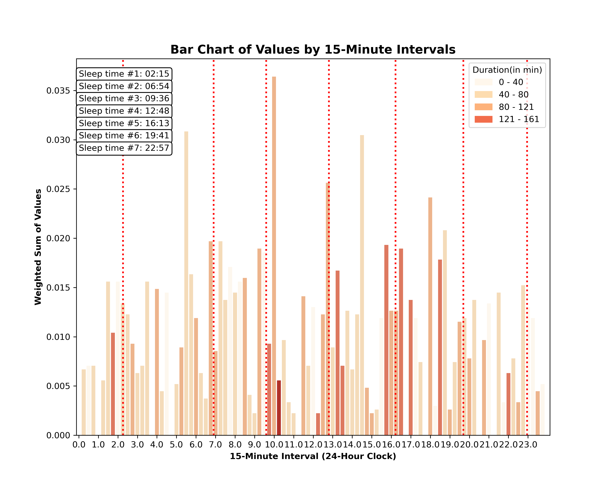

# Infant_Sleep_Analysis

**Project Title:** Predicting Sleeping Patterns for Infants

**Project Overview:** Newborn sleep times can be mysterious where they wake up in the middle of the night for no reason, suddenly change, decide that nap isn’t worth taking and a lot changes through one week to the next. This Project was in effort to use the data collected through the app Baby Tracker in a csv file to use predictive modeling finding sleep patterns and suggestions for newborn natural sleep times.  This is meant to put into a format anyone with data from the app can drop the files here and be able to output the same analysis. 

**Methodology:**
* Data Acquisition: Collecting data from myself from my child and entering it in.  The trial to form the code is essentially data collected by me.  Eventually, it should be put into a form that the code can by used by others with the baby app just through a drag and drop of the csv file it exports to use for sleep cycle prediction for their child.
*	Data Preprocessing: Cleaned and prepared the data by reformatting the datatimes
*	Feature Engineering: 
*	Model Selection and Training: 
*	Model Evaluation: 

**Results and Outcomes:**

Markdown

**Challenges and Lessons Learned:**

**Additional Information:**
*	The project was implemented using Python and libraries like Pandas, NumPy, Scikit-learn.
*	The code is available on GitHub at [link to GitHub repository].
*	Collaborators: [List of collaborators]
*	
Keywords: clustering, MeanShift, GMM, Gaussian Mixed Model, DBSCAN, 

